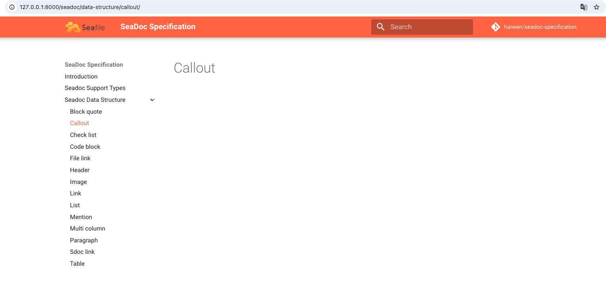

# SeaDoc Specification

This project mainly describes the document node types supported by sdoc files and the data structure of document node types to facilitate the use and communication of data.

## Document address

https://haiwen.github.io/seadoc-specification/

## How to use 

### Install Dependencies
```
pip install mkdocs mkdocs-material mkdocs-awesome-pages-plugin mkdocs-material-extensions
```

### Start a Project
```
mkdocs serve
```

### Open the webpage

If you open the webpage and can see the locally deployed project, it means that you have completed the local environment setup



## Others

If you have any problems with your local python, you can refer to this document [Python Problems and Solutions](https://dev.seafile.com/seahub/f/6a0408941ceb4fc49608/)


